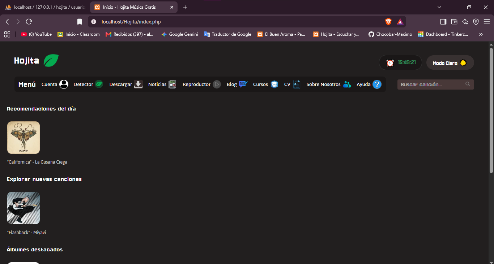
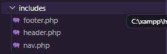
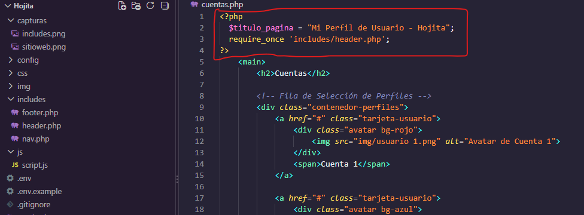
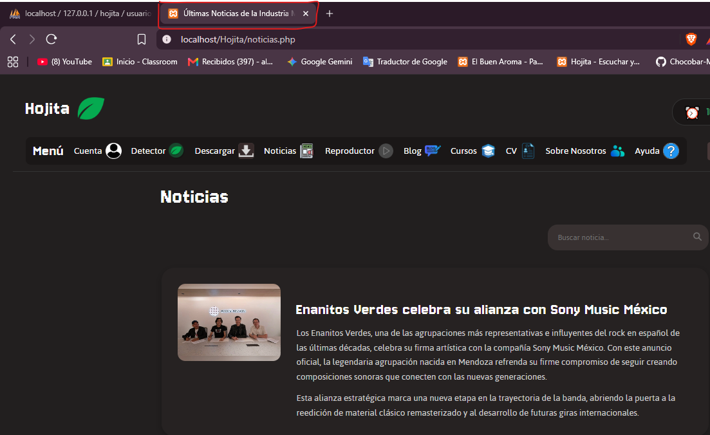
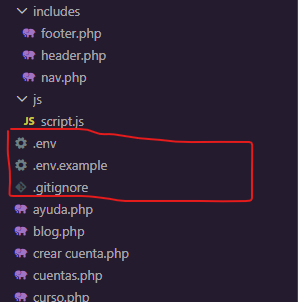

 Hojita - Plataforma de Música Digital

1. Descripción del Proyecto
Hojita es una plataforma web dedicada a la transmisión, descubrimiento y descarga de música digital en línea. 

En esta etapa (Unidad 4 - Programación Web), el proyecto evolucionó desde una maqueta estática compuesta por archivos HTML hacia una aplicación web dinámica basada en PHP. Se implementó la técnica de Server-Side Includes (SSI) para la modularización de componentes reutilizables (`header.php`, `nav.php`, `footer.php`), la gestión centralizada de configuraciones mediante variables de entorno (`.env`), y la renderización del lado del servidor (SSR) para títulos de página y navegación dinámica.

2. Enlace al Prototipo de Figma
Podés consultar el diseño y prototipado inicial del proyecto en el siguiente enlace:
*  'https://www.figma.com/design/B0rzDYVbuGJT0nObl8nOs5/Mockups-Figma?node-id=0-1&p=f&t=Ae1cLPn8BnH0kBBd-0'

3. Tecnologías Utilizadas:
* HTML5 & CSS3: Estructura semántica y maquetación responsive.
* JavaScript: Interactividad en tiempo real (reloj, formularios, modo oscuro/claro).
* PHP: Lenguaje del lado del servidor para modularización (SSI) y SSR.
* MySQL: Base de datos relacional para el almacenamiento de datos.
* XAMPP: Servidor local (Apache + MySQL).
* GitHub: Control de versiones y flujo de trabajo colaborativo.

4. Instrucciones de Instalación y Ejecución Local: 
 a. Descargar e instalar XAMPP (https://www.apachefriends.org/es/download.html).
 b. Descargar los archivos del sitio web de este repositorio (como los archivos PHP, JS, CSS, TXT, imagenes de la carpeta 'img' pero no de 'capturas', etc.).
 c. Mantener la estrucutra de carpetas y archivos de la siguiente manera: 

   Hojita/
├── config/
│   └── env.php
├── css/
│   └── estilos.css
├── includes/
│   ├── footer.php
│   ├── header.php
│   └── nav.php
├── img/
├── js/
│   └── script.js
├── .env
├── .env.example
├── .gitignore
├── index.php
└── demas_archivos.php

 d. Ejecutar XAMPP y activar Apache y MySQL.
 e. Clonar la carpeta donde están almacenados todos los archivos descargados desde GitHub y moverla a la siguiente dirección de tu computadora: 'C:\xampp\htdocs'
 f. Entrar desde el navegador a 'http://localhost/phpmyadmin/' para crear la base de datos. Dirigirse a pestaña SQL y ejecutar el siguiente codigo:

CREATE DATABASE IF NOT EXISTS `hojita` 
CHARACTER SET utf8mb4 
COLLATE utf8mb4_unicode_ci;

USE `hojita`;

CREATE TABLE IF NOT EXISTS `usuarios` (
    `id` INT AUTO_INCREMENT PRIMARY KEY,
    `username` VARCHAR(50) NOT NULL,
    `correo` VARCHAR(100) NOT NULL UNIQUE,
    `pass` VARCHAR(255) NOT NULL,
    `cumpleanos` DATE NULL,
    `genero` ENUM('masculino', 'femenino', 'otro') DEFAULT 'otro',
    `creado_en` TIMESTAMP DEFAULT CURRENT_TIMESTAMP
) ENGINE=InnoDB DEFAULT CHARSET=utf8mb4;

CREATE TABLE IF NOT EXISTS `canciones` (
    `id` INT AUTO_INCREMENT PRIMARY KEY,
    `titulo` VARCHAR(100) NOT NULL,
    `artista` VARCHAR(100) NOT NULL,
    `album` VARCHAR(100) NULL,
    `portada_url` VARCHAR(255) NULL,
    `destacado` TINYINT(1) DEFAULT 0,
    `creado_en` TIMESTAMP DEFAULT CURRENT_TIMESTAMP
) ENGINE=InnoDB DEFAULT CHARSET=utf8mb4;

INSERT INTO `canciones` (`titulo`, `artista`, `album`, `portada_url`, `destacado`) VALUES
('Californica', 'La Gusana Ciega', 'Monarca', 'https://encrypted-tbn0.gstatic.com/images?q=tbn:ANd9GcRe79c7jA8bt19GhSuQWdXuIHJzbxTAUQEZjw&s', 1),
('Flashback', 'Miyavi', 'NO BORDER', 'img/flashback.jpg', 1),
('O My Heart', 'Mother Mother', 'O My Heart', 'https://akamai.sscdn.co/uploadfile/letras/albuns/d/e/2/1/945321597665394.jpg', 1);

 g. Dirigirse a nuestro sitio web con el siguiente enlace: http://localhost/nombre_del_sitio_web/index.php (en nuestro caso: http://localhost/Hojita/index.php).

5. Evidencia de Funcionamiento (Capturas de Pantalla):
a. Captura del sitio corriendo en el navegador:

b. Estructura Modular (SSI):

c. Navegación Dinámica:

d. Configuración de Variables de Entorno:

